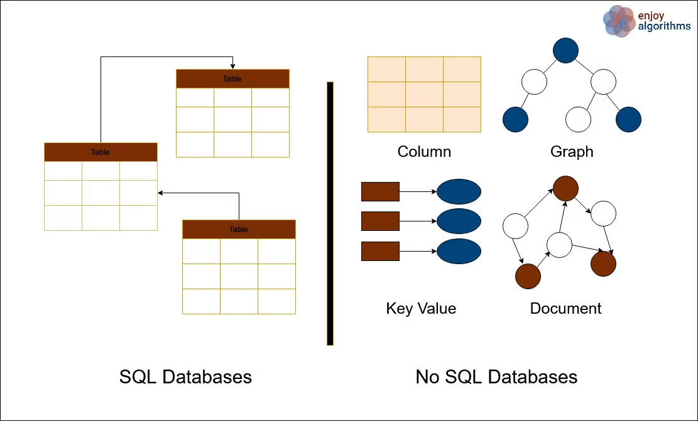

## EP-12 : Database - SQL & NoSQL

### What is Database and DBMS :

In [computing](https://en.wikipedia.org/wiki/Computing), a **database** is an organized collection of [data](<https://en.wikipedia.org/wiki/Data_(computing)>) or a type of [data store](https://en.wikipedia.org/wiki/Data_store) based on the use of a **database management system** (**DBMS**), the [software](https://en.wikipedia.org/wiki/Software) that interacts with [end users](https://en.wikipedia.org/wiki/End_user), [applications](https://en.wikipedia.org/wiki/Application_software), and the database itself to capture and analyze the data.

The DBMS additionally encompasses the core facilities provided to administer the database. The sum total of the database, the DBMS and the associated applications can be referred to as a **database system**. Often the term "database" is also used loosely to refer to any of the DBMS, the database system or an application associated with the database.

---

**Major Types of Databases :**

1. Relational Databases (MySQL, PostgreSQL)
2. NoSQL Databases (MongoDB)

**NOTE** : There are many more types of DB also.

---

### **Difference between RDBMS and NoSQL**

MongoDB is Document database.

Note : as in MySql we have table - in MongoDB we have collection

in MySql we have row - in MongoDB we have document

in MySql we have column - in MongoDB we have field

---

### **What is** Normalization :

- Normalization is the process of organizing the data in the database.
- Normalization is used to minimize the redundancy from a relation or set of relations. It is also used to eliminate undesirable characteristics like Insertion, Update, and Deletion Anomalies.
- Normalization divides the larger table into smaller and links them using relationships.
- The normal form is used to reduce redundancy from the database table.

---

## EP-13 : Creating a DB :

### Steps to setup MongoDB :

go to mongoDB > create new project > create a free M0 cluster > create a user & password > get a connection string > download mongoDBCompass (UI for mongoDB) > paste the string into new connection > GOOD TO GOOOOO….

Starting in project > npm install mongodb >

Inital Setup : https://www.mongodb.com/docs/drivers/node/current/quick-start/connect-to-mongodb/

How to use : https://www.mongodb.com/docs/drivers/node/current/usage-examples

---
