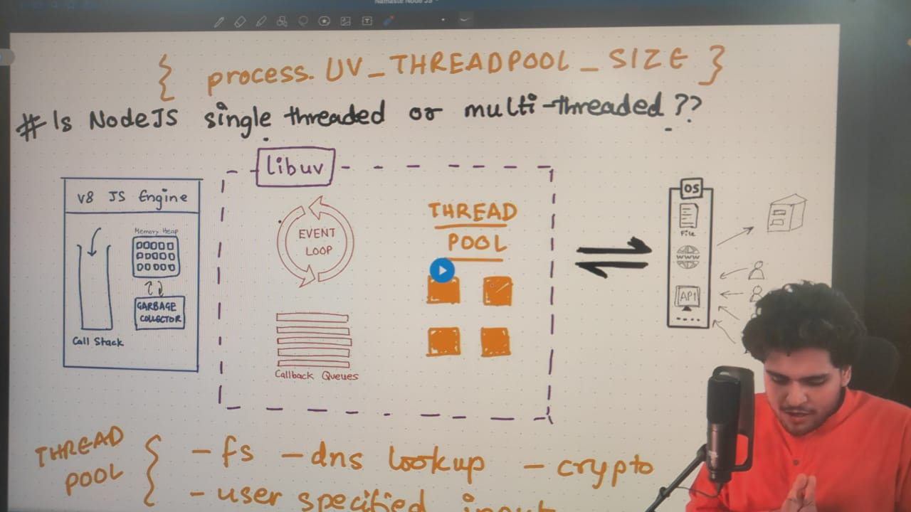

## Lec-3 : Let’s Write Code

When we Install nodejs, npm also gets installed.

Just type **node** in terminal and starting writing code — Node REPL ⇒ Read, Evaluate, Print, Loop.

i.e. Node is a JS runtime enviroment.

Window Object is given to us by browser. — this,self,frames also points to window obj on browser.

Global Object is given to us by Node (one of the superpower) — this is empty object in node.

globalThis ⇒ for all global things either in browser or in node.
