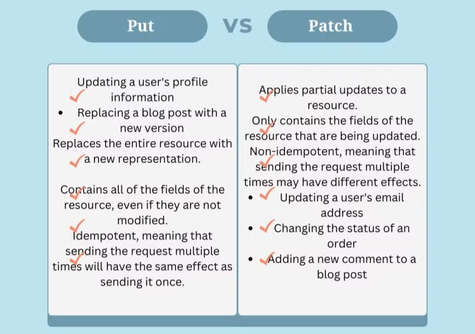

## Lec-1 : Microservice & Monolith

### SDLC Model :

The waterfall Model illustrates the software development process in a linear sequential flow. This means that any phase in the development process begins only if the previous phase is complete. In this waterfall model, the phases do not overlap.

PM = Project Manager

EM = Engineer Manager

Maintainance = Repeating all above steps

---

### Monolith VS Microservices :

## 

## Lec-2 : Features , HLD , LLD :

### We are making Dev Tinder.

1. **What are the features our project will have :**

2. **Tech Planning :**

Frontend - reactJS

Backend - NodeJS, MongoDB

3. **LLD (Low Level Design):**

this is done by developers (SD1, SD2)

like what api’s needed

like designing of DB

like what endpoints needed

## 

### HTTP Methods : Get, Post , Delete , Put, Patch

---

### What API’s should we make (part of planning) :

## 

## Lec-3 : Creating Express Server :
