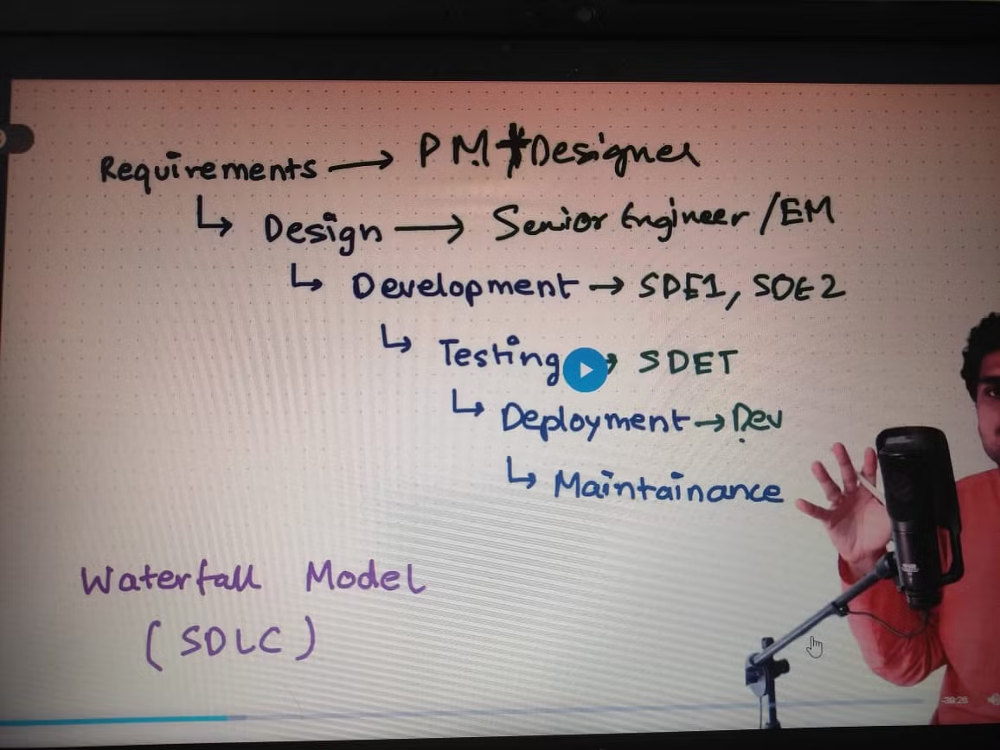

One Circle from timer to close phase is k/as 1 tick.

For Libuv we have 4 thread pool by default, k/as UV_THREADPOOL_SIZE.

V8 engine is Single Threaded

Libuv makes NodeJs multithreaded.

## **NodeJS is single/multi**

**Answer ⇒** NodeJs is single threaded for sync code and multi-threaded if async code.

---

We can change no. of thread pool by process.env.UV_THREADPOOL_SIZE
